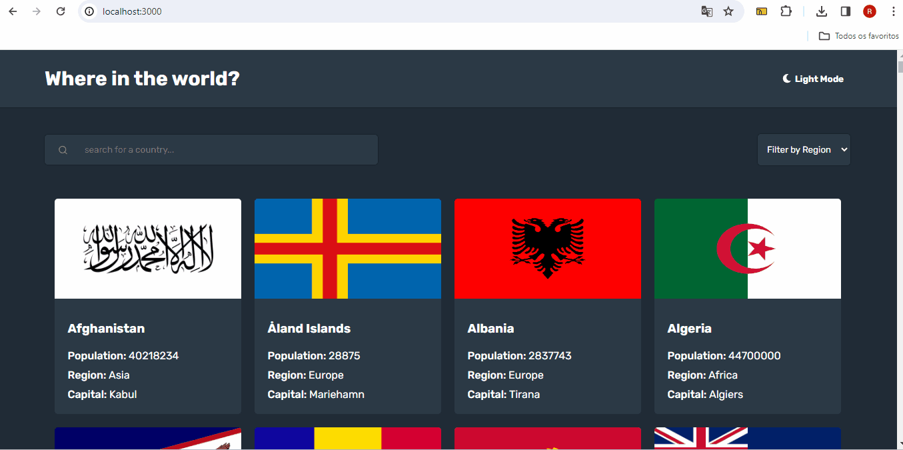

# Countries REST

## Descrição
   - Esse é um projeto de REST countries API usando REACT, single-page application (SPA). (Projeto do frontendmentor.io https://www.frontendmentor.io). 


## Funcionalidades
- Alterna tema em claro/light ou escuro/dark.
- Um input que filtra os países pelo seu nome.
- Um select que filtra os países pela sua região.
- Ao clicar em um país apresenta as suas informações detalhadas.

## Tecnologias

- Styled Components: Estilizar os componentes sem um arquivo css.
- React Router: Usada para facilitar a navegação dentro da aplicação.
- countryAPI: Usada para buscar os pokemons.
- Axios: Foi usado para buscar os dados ao invés do Fetch.
- Context API: Para a criação de uma função que alterna o tema do projeto.

## Gifs

###  Navegação e filtro continentes


###  Filtro país e detalhes.


## Como utilizar

### clone do projeto
```
    git clone https://github.com/Ryanvrl/country-react.git
```

### Acessar a pasta
```
    cd "projeto"
```

### Instalação
```
    npm install
```

### Começar
```
    npm start
```


